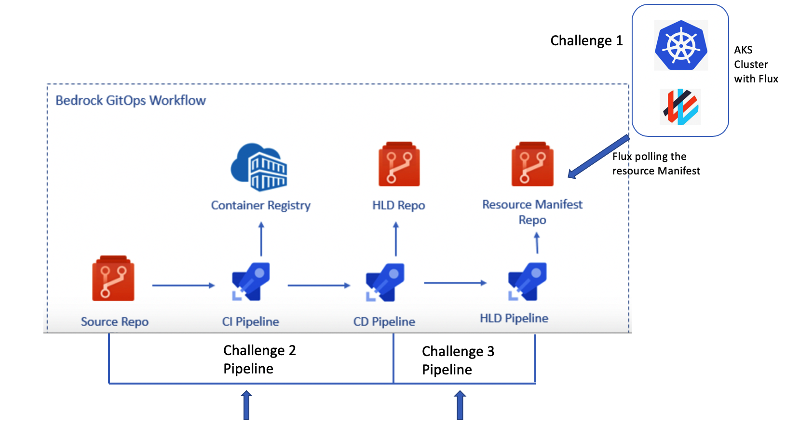
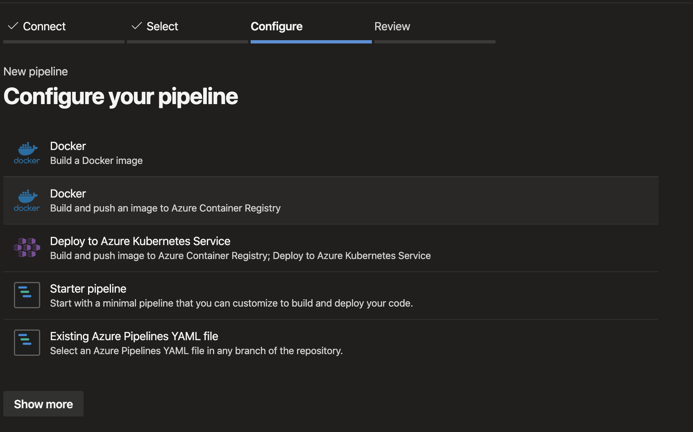
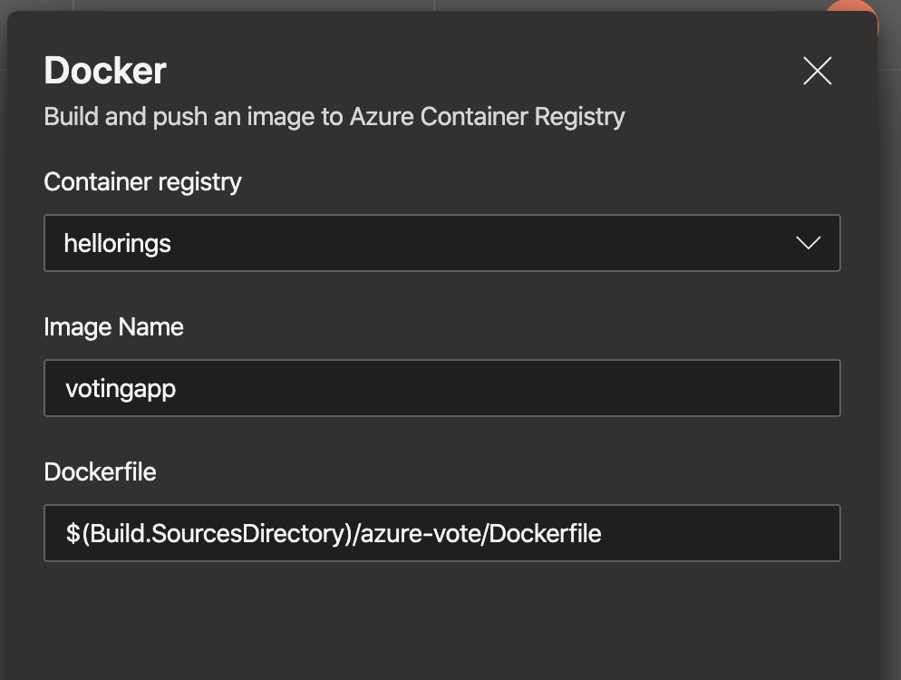
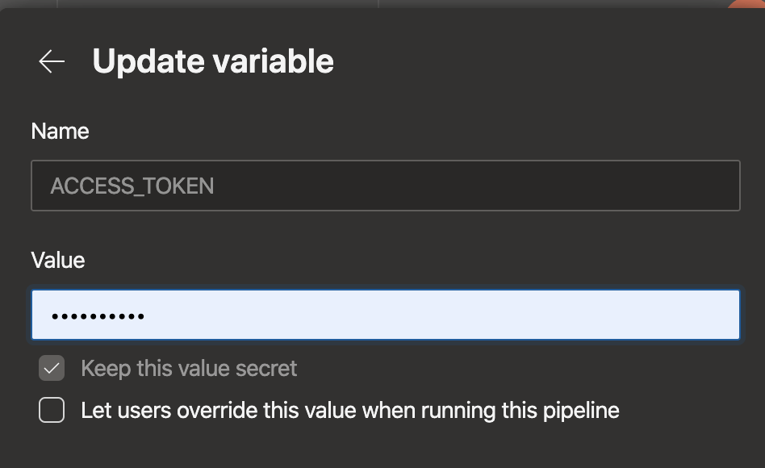
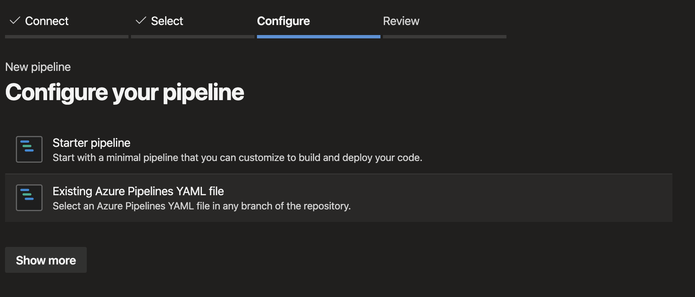
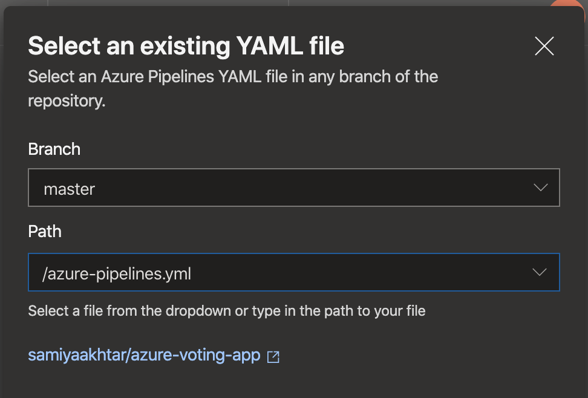
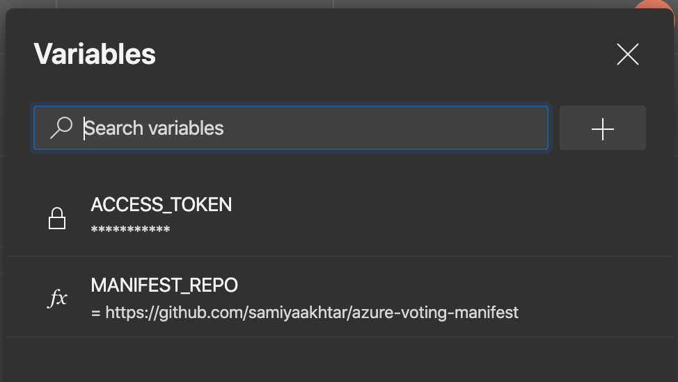

# Azure Voting app using Bedrock

If you would like to deploy the azure voting app using bedrock, follow the guide below. Follow the GitOps tutorial on this [page](https://github.com/microsoft/bedrock/tree/master/gitops/azure-devops) to understand the overall Bedrock pipelines infrastructure.

The following diagram describes overview of the various challenges 
  
You will be working with three repos for this exercise - code repo, HLD (high level definition) repo and manifest repo
## Create the source build pipeline (Challenge 2)

The first step is to build a container image of this azure voting app and push it to Azure Container Registry. 
Go to Azure portal and provision a Azure Container Registry in the same resource group where you provisioned your cluster from Challenge 1.

There's already a Dockerfile provided to you in this [path](https://github.com/samiyaakhtar/azure-voting-app-redis/blob/master/azure-vote/Dockerfile) that needs to be used by the continuous integration pipelines to create the docker build. 

1. Before you start with Challenge 2 and 3, make sure you enabled multistage pipelines in your Azure Dev Ops. 
2. Create a fork of the repository located [here](https://github.com/Azure-Samples/azure-voting-app-redis). 
3. Click on `New pipeline` in your Azure DevOps Project under Pipelines
4. Select your forked repository under the repositories section.
5. Next, it should show you a page with a list of pre-defined tasks. Select `Docker Build and push an image to Azure Container Registry`.
    
6. It should load all your available subscriptions. Select the appropriate subscription.
7. Select an available container registry and enter an image name. 
    
8. Click on `Validate and configure` and run the pipeline. 
9. You should be able to see a new repository created under your ACR for this new image.


## Create the image tag release pipeline

Before we begin, you need to create a fork of the [HLD repository](https://github.com/samiyaakhtar/azure-voting-app). 

Assuming that we're using multi-stage pipelines for the purpose of this voting app, go into editing mode for your first source pipeline and you should be able to edit the yaml file inline. 

Insert the following stage towards the end of the yaml file. This will perform the following steps:
1. Run when the build stage passes
2. Download the bedrock release and build scripts, and source them
3. Execute the release script

```yaml
- stage: hld_update
  displayName: ACR to HLD Stage
  dependsOn: Build
  condition: succeeded('Build')
  jobs:
  - job: hld_update
    displayName: HLD Update
    pool:
      vmImage: $(vmImageName)
    steps:
    - bash: |
        # Download build.sh
        curl https://raw.githubusercontent.com/Microsoft/bedrock/master/gitops/azure-devops/build.sh > build.sh
        chmod +x ./build.sh

        curl https://raw.githubusercontent.com/Microsoft/bedrock/master/gitops/azure-devops/release.sh > release.sh
        chmod +x ./release.sh

        # Execute release.sh
        . release.sh
      displayName: Bash step
      env:
        ACCESS_TOKEN_SECRET: $(ACCESS_TOKEN)
        COMMIT_MESSAGE: Update front end image tag to $(Build.BuildId)
        SUBCOMPONENT: azure-vote
        YAML_PATH: azureVoteFront.deployment.imageTag
        YAML_PATH_VALUE: $(Build.BuildId)
        REPO: https://github.com/<your user name>/azure-voting-app.git
```
Create a personal access token for your GitHub account and save it someplace
Add a Variable called `ACCESS_TOKEN` and enter your personal access token for GitHub, and make this variable a secret. 



Click on `Save` button, it will prompt you to push the changes to the repository. Click commit and watch the logs for the running pipeline. You should be able to see a new commit in your HLD repository after the stage is complete. 

## Create the manifest generation pipeline (Challenge 3)

Create a new empty repository in your GitHub, call it something like `azure-voting-manifest`

The Manifest generation pipeline needs to be triggered off any changes on the HLD repository. 

1. Go into pipelines in your Azure DevOps project and click on new pipeline.
2. Select your forked HLD repository (`<username>/azure-voting-app`).
3. Click on `Existing Azure Pipelines YAML file`
     
4. Choose the `azure-pipelines.yml` file located in the root directory and click on Continue.
    
5. It should start to run the pipeline. Since the variables are not yet defined, this may fail, so you will need to click on `Edit` for this pipeline and add the following variables:
    

    Make sure that the `MANIFEST_REPO` variable is set to your newly created repository for storing kubernetes manifests.
6. You need to make changes to ACR url so that it points to your ACR. To do this go to your HLD repo and update the ACR in the following file azure-voting-app<or your HLD>/charts/azure-voting-app/values.yaml

7. Run the pipeline once again and it should succeed. 

# Bedrock setup is complete

Your basic setup of Bedrock is now complete. You should be able to deploy a cluster and point it to the manifest repository, based on instructions [here](https://github.com/microsoft/bedrock/blob/master/docs/azure-simple/README.md).

If you make a change to the source code, it should propogate to the manifest, and to the cluster. Try changing cats and dogs in the [source repo](https://github.com/Azure-Samples/azure-voting-app-redis/blob/master/azure-vote/azure-vote/config_file.cfg) to something else!
